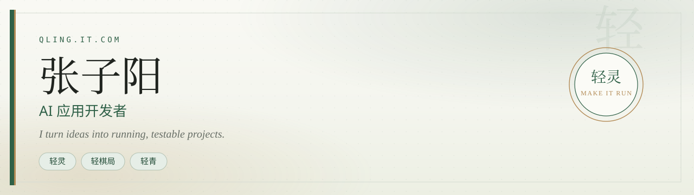

  
  

    
    
  

软件工程学生。我把产品想法做成能运行、能验证的项目。  
I turn ideas into running, testable projects.

代表作是轻·棋局、轻灵和轻青；项目里有 AI 协作，技术栈不等于我已熟练掌握的技能。

**[打开个人站](https://qling.it.com/)** · [在线简历](https://qling.it.com/resume) · [CSDN](https://blog.csdn.net/Zzydzyg0618)

---

## 代表作

**轻·棋局 XiangqiArena**  
把象棋 / 五子棋 / 围棋收到同一个 Java Web 站。  
[线上站点](https://www.xiangqiarena.com/) · [源码](https://github.com/Zzy-min/Chinese-chess)

**轻灵 Qling**  
本地优先的中文 AI Agent CLI。  
[源码](https://github.com/Zzy-min/qling) · [npm](https://www.npmjs.com/package/@qlingzzy/qling)

**轻青 Qingqing**  
供应商中立的个人创作 Agent。  
[源码](https://github.com/Zzy-min/qingqing)

---

## 在做什么

  
  

  

  <picture>
    <source media="(prefers-color-scheme: dark)" srcset="https://raw.githubusercontent.com/Zzy-min/Zzy-min/output/github-snake-dark.svg" />
    
  </picture>

---

## 联系

正在寻找 AI Agent 开发实践机会。

- 个人站：[qling.it.com](https://qling.it.com/)
- 邮箱：[2293822701@qq.com](mailto:2293822701@qq.com) · [zzy19812007@gmail.com](mailto:zzy19812007@gmail.com)
- 博客：[CSDN](https://blog.csdn.net/Zzydzyg0618)
