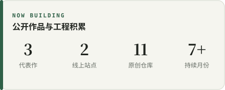
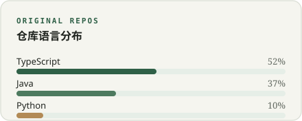

  
  

    
    
    
    
  

软件工程学生。我把产品想法做成能运行、能验证的项目。  
*I turn ideas into running, testable projects.*

代表作是轻·棋局、轻灵和轻青；项目里有 AI 协作，技术栈不等于我已熟练掌握的技能。

---

### 🚀 代表作 / Featured Projects

<table>
  <tr>
    <td width="33%" valign="top">
      <h4 align="center">♟️ 轻·棋局</h4>
      
<strong>XiangqiArena</strong>

      
将中国象棋、五子棋、围棋汇聚一体的 Java Web 综合对弈平台。

      

        
        
        
      

    </td>
    <td width="33%" valign="top">
      <h4 align="center">⚡ 轻灵</h4>
      
<strong>Qling CLI</strong>

      
本地优先、轻量级的中文 AI Agent 命令行与自动化工具。

      

        
        
        
      

    </td>
    <td width="33%" valign="top">
      <h4 align="center">🌱 轻青</h4>
      
<strong>Qingqing</strong>

      
供应商中立、专注长文与多媒体处理的个人创作 Agent。

      

        
        
        
      

    </td>
  </tr>
</table>

---

### 🧰 技术栈 / Tech Stack

  

---

### 📊 工程积累与状态 / Activity & Stats

  
  

  <i>语言占比按原创仓库体积估算，不等于个人熟练度。</i>

  <picture>
    <source media="(prefers-color-scheme: dark)" srcset="https://raw.githubusercontent.com/Zzy-min/Zzy-min/output/github-snake-dark.svg" />
    
  </picture>

---

### 📬 联系与交流 / Contact

正在寻找 AI Agent 开发与工程实践机会。

- 🌐 个人站：[qling.it.com](https://qling.it.com/)
- 📄 在线简历：[qling.it.com/resume](https://qling.it.com/resume)
- 📧 邮箱：[2293822701@qq.com](mailto:2293822701@qq.com) · [zzy19812007@gmail.com](mailto:zzy19812007@gmail.com)
- 📝 博客：[CSDN @Zzydzyg0618](https://blog.csdn.net/Zzydzyg0618)
